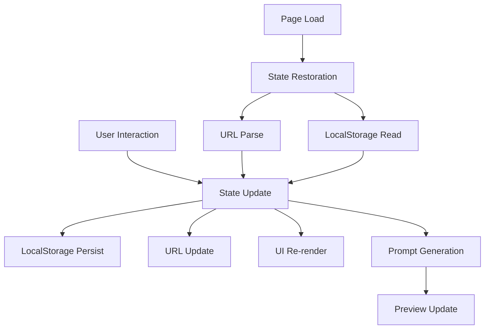

# Technical & UX Design — Project Initiator

Tag: [Design → Execution], [Design → QA]

Last updated: 2025-09-07

## Design Overview
This document provides technical architecture, UX design, and implementation guidance for Project Initiator - a static web app that helps developers generate high-quality prompts for coding agents through guided decision-making.

**Core Design Principles:**
- **Mobile-first**: Optimized for touch devices with responsive enhancement for desktop
- **Privacy-first**: No data leaves browser without explicit user action
- **Progressive disclosure**: Complex decisions revealed gradually through accordion interface
- **Direct integration**: One-click sharing to popular coding assistants
- **Vendor neutrality**: Generated prompts work across different coding agents
- **Performance-first**: Fast load times and responsive interactions

---

## Technical Architecture

### System Architecture Diagram
```
┌─────────────────────────────────────────────────────────────┐
│                    GitHub Pages (Static Host)               │
├─────────────────────────────────────────────────────────────┤
│                                                             │
│  ┌─────────────────┐  ┌─────────────────┐  ┌──────────────┐ │
│  │   UI Components │  │  State Manager  │  │ Prompt Engine│ │
│  │   - Categories  │  │  - LocalStorage │  │ - Templates  │ │
│  │   - Preview     │◄─┤  - URL Sync     │◄─┤ - Validation │ │
│  │   - Presets     │  │  - Persistence  │  │ - Generation │ │
│  └─────────────────┘  └─────────────────┘  └──────────────┘ │
│                                                             │
├─────────────────────────────────────────────────────────────┤
│                     Browser APIs                            │
│     LocalStorage | History API | Clipboard API             │
└─────────────────────────────────────────────────────────────┘
```

### Component Architecture **[Design → Execution]**
```typescript
// Core application structure
src/
├── components/           // UI components
│   ├── DecisionAccordion/ // Mobile-first accordion sections
│   ├── PromptPreview/   // Live prompt display
│   ├── PresetSelector/  // Template quick-start
│   ├── IntegrationLinks/ // Chatbot sharing buttons
│   └── shared/          // Common UI elements (Button, Card, etc.)
├── core/                // Business logic
│   ├── state.ts         // Zustand state management
│   ├── prompt-engine.ts // Prompt generation
│   ├── integrations.ts  // Chatbot URL builders
│   └── templates/       // Prompt templates
├── types/               // TypeScript definitions
├── utils/               // Helper functions
└── styles/              // Tailwind CSS configuration
```

### Data Flow Design **[Design → Execution]**


### Alternative Architectures Considered

**Option A: Vanilla JavaScript with Web Components** ⭐ CHOSEN
- ✅ No framework dependencies (~20KB total bundle)
- ✅ Native browser standards
- ✅ Easy to understand and maintain
- ✅ Fast initial load
- ❌ More manual DOM management

**Option B: Lightweight Framework (Preact/Svelte)**
- ✅ Better developer experience
- ✅ More robust reactivity
- ❌ Framework learning curve
- ❌ Larger bundle size (40-60KB)

**Option C: Full Framework (React/Vue)**
- ✅ Rich ecosystem
- ✅ Advanced tooling
- ❌ Significant bundle size (100KB+)
- ❌ Overkill for this use case

### Rationale for Vanilla + Web Components
Given the project's simplicity, performance requirements, and static hosting constraints, vanilla JavaScript with modern web standards provides the optimal balance of maintainability and performance.

---

## UX Design Specification

### User Journey Map **[Design → QA]**
```
Entry → Preset Selection → Decision Categories → Prompt Review → Copy/Share → Exit
  │         │                    │                │             │
  │         └─ Quick start       │                │             └─ Success state
  │                              │                │
  │         ┌─ Progressive       │                └─ Validation & refinement
  └─ Landing disclosure         │
            └─ Smart defaults   └─ Real-time feedback
```

### Information Architecture
```
┌─────────────────────────────────────────────────────────────┐
│                        Header                               │
│     Project Initiator | [Reset] [Import/Export]            │
├─────────────────────────────────────────────────────────────┤
│  Tab Navigation                                             │
│  [✓Presets] [○Project] [○Quality] [○Deploy] [○Advanced]     │
├─────────────────────────────────────────────────────────────┤
│                                                             │
│  ┌─────────────────────┐    ┌───────────────────────────┐   │
│  │                     │    │    Live Prompt Preview   │   │
│  │   Active Tab        │    │                           │   │
│  │   Content           │    │  # Generated Prompt       │   │
│  │                     │    │                           │   │
│  │  ┌─────────────┐    │    │  Context: Building a...   │   │
│  │  │ Decision    │    │    │                           │   │
│  │  │ Items       │    │    │  Requirements:            │   │
│  │  │             │    │    │  - Static hosting         │   │
│  │  └─────────────┘    │    │  - No backend            │   │
│  │                     │    │                           │   │
│  │  [< Previous] [Next >]   │  [Copy] [Share] [Export]  │   │
│  └─────────────────────┘    └───────────────────────────┘   │
│                                                             │
└─────────────────────────────────────────────────────────────┘
```

### Progressive Disclosure Strategy **[Design → Execution]**
1. **Presets Tab**: Immediate value with 3-4 common scenarios
2. **Project Tab**: Core decisions (type, runtime, basic features)
3. **Quality Tab**: Testing, linting, CI/CD preferences
4. **Deploy Tab**: Hosting, distribution, publishing options
5. **Advanced Tab**: Security, documentation, edge cases

### Accessibility Design **[Design → QA]**
- **WCAG AA Compliance**: Color contrast ≥4.5:1, keyboard navigation
- **Screen Reader Support**: Semantic HTML, ARIA labels, live regions
- **Progressive Enhancement**: Works without JavaScript for basic viewing
- **Reduced Motion**: Respects `prefers-reduced-motion` for animations

---

## Component Specifications

### DecisionCategory Component
```typescript
interface DecisionCategoryProps {
  id: string;
  title: string;
  description: string;
  items: DecisionItem[];
  currentValues: Record<string, any>;
  onChange: (values: Record<string, any>) => void;
}

interface DecisionItem {
  id: string;
  type: 'radio' | 'checkbox' | 'select' | 'text';
  label: string;
  helpText?: string;
  options?: Option[];
  defaultValue?: any;
  dependencies?: string[]; // Show only if other items have specific values
}
```

### PromptPreview Component
```typescript
interface PromptPreviewProps {
  state: ProjectState;
  template: PromptTemplate;
  onCopy: () => void;
  onShare: () => void;
  onExport: () => void;
}

interface PromptSection {
  heading: string;
  content: string;
  priority: 'required' | 'recommended' | 'optional';
}
```

### State Management Interface
```typescript
interface ProjectState {
  // Core project decisions
  projectType: 'cli' | 'web-spa' | 'web-mpa' | 'api-rest' | 'library' | 'mcp-server';
  runtime: 'node' | 'browser' | 'python' | 'rust' | 'go';
  
  // Quality and automation
  quality: {
    linting: boolean;
    testing: 'none' | 'unit' | 'integration' | 'e2e';
    ci: boolean;
    formatting: boolean;
  };
  
  // Hosting and deployment
  hosting: 'github-pages' | 'vercel' | 'netlify' | 'selfhosted';
  deployment: {
    customDomain: boolean;
    seo: boolean;
    analytics: boolean;
  };
  
  // Documentation and compliance
  documentation: {
    readme: boolean;
    license: 'MIT' | 'Apache-2.0' | 'GPL-3.0' | 'none';
    changelog: boolean;
    contributing: boolean;
  };
  
  // Advanced options
  advanced: {
    secrets: 'none' | 'env' | 'ci-secrets';
    security: boolean;
    accessibility: boolean;
  };
}
```

---

## Project Structure & Hygiene **[Design → Product]** **[Design → Execution]**

### Recommended Repository Structure
```
project-initiator/
├── .github/
│   ├── workflows/
│   │   ├── ci.yml                 # Build, test, lint
│   │   └── deploy.yml             # GitHub Pages deployment
│   └── ISSUE_TEMPLATE/
│       └── bug_report.md
├── public/                        # Static assets
│   ├── favicon.ico
│   ├── manifest.json              # PWA manifest
│   └── robots.txt
├── src/
│   ├── components/
│   │   ├── DecisionCategory/
│   │   │   ├── index.ts
│   │   │   ├── DecisionCategory.ts
│   │   │   └── DecisionCategory.css
│   │   ├── PromptPreview/
│   │   │   ├── index.ts
│   │   │   ├── PromptPreview.ts
│   │   │   └── PromptPreview.css
│   │   └── shared/
│   │       ├── Button/
│   │       ├── TabNavigation/
│   │       └── LoadingSpinner/
│   ├── core/
│   │   ├── state.ts               # State management
│   │   ├── prompt-engine.ts       # Prompt generation logic
│   │   ├── persistence.ts         # LocalStorage & URL handling
│   │   └── templates/
│   │       ├── cli-template.ts
│   │       ├── spa-template.ts
│   │       └── mcp-template.ts
│   ├── styles/
│   │   ├── design-tokens.css      # Colors, spacing, typography
│   │   ├── global.css             # Reset, base styles
│   │   └── utilities.css          # Helper classes
│   ├── types/
│   │   ├── app.ts                 # Core type definitions
│   │   └── templates.ts           # Template interfaces
│   ├── utils/
│   │   ├── validation.ts          # Input validation
│   │   ├── url-encoding.ts        # State serialization
│   │   └── accessibility.ts       # A11y helpers
│   ├── app.ts                     # Main application entry
│   └── index.html                 # HTML template
├── tests/
│   ├── unit/
│   │   ├── components/
│   │   ├── core/
│   │   └── utils/
│   ├── integration/
│   │   └── user-flows.test.ts
│   └── setup.ts                   # Test configuration
├── docs/                          # Project documentation
├── .gitignore                     # Node.js focused
├── package.json                   # Dependencies and scripts
├── vite.config.ts                 # Build configuration
├── tsconfig.json                  # TypeScript configuration
├── eslint.config.js               # Linting rules
├── prettier.config.js             # Code formatting
└── README.md
```

### Essential Configuration Files **[Design → Execution]**

**package.json** additions needed:
```json
{
  "scripts": {
    "dev": "vite",
    "build": "vite build",
    "preview": "vite preview",
    "test": "vitest",
    "lint": "eslint src --ext .ts,.js",
    "format": "prettier --write src/**/*.{ts,js,css,html}"
  },
  "devDependencies": {
    "vite": "^5.0.0",
    "typescript": "^5.0.0",
    "@typescript-eslint/eslint-plugin": "^6.0.0",
    "prettier": "^3.0.0",
    "vitest": "^1.0.0",
    "@vitest/ui": "^1.0.0"
  }
}
```

**vite.config.ts**:
```typescript
import { defineConfig } from 'vite';

export default defineConfig({
  base: '/project-initiator/', // GitHub Pages subpath
  build: {
    outDir: 'dist',
    target: 'es2020',
    rollupOptions: {
      output: {
        manualChunks: {
          templates: ['src/core/templates']
        }
      }
    }
  },
  server: {
    port: 3000
  }
});
```

---

## Performance & Security Design

### Performance Targets **[Design → QA]**
- **Initial Load**: <1s on typical broadband (Core Web Vitals)
- **Bundle Size**: <100KB gzipped total
- **Runtime Performance**: 60fps interactions, <100ms state updates
- **Accessibility**: Lighthouse accessibility score ≥95

### Security Considerations **[Design → Execution]**
- **Content Security Policy**: Strict CSP headers for GitHub Pages
- **Input Validation**: Client-side validation for all user inputs
- **XSS Prevention**: Sanitize any dynamic content rendering
- **Privacy**: No external analytics or tracking by default

### Browser Compatibility
- **Target**: ES2020+ (Chrome 80+, Firefox 72+, Safari 13.1+, Edge 80+)
- **Fallbacks**: Progressive enhancement for older browsers
- **Testing**: BrowserStack integration for cross-browser validation

---

## Implementation Phases **[Design → Execution]**

### Phase 1: Foundation (Epic 1-2)
1. **Project scaffolding** with Vite + TypeScript
2. **Basic component structure** and routing
3. **State management** implementation
4. **Core decision categories** (Project, Quality)
5. **Simple prompt generation** with 2-3 templates

### Phase 2: UX Polish (Epic 3)
1. **Progressive disclosure** tab implementation
2. **Preset templates** for common scenarios
3. **URL sharing** and export functionality
4. **Responsive design** and mobile optimization
5. **Accessibility** compliance

### Phase 3: Extensibility (Epic 4-5)
1. **Plugin architecture** for new templates
2. **MCP-specific templates** and flows
3. **Community contribution** framework
4. **PWA features** for offline use
5. **Advanced customization** options

---

## Risk Mitigation & Trade-offs

### Technical Risks **[Design → QA]**
1. **Bundle size growth**: Mitigated by lazy loading and tree-shaking
2. **State complexity**: Addressed through clear interfaces and validation
3. **Browser compatibility**: Progressive enhancement strategy
4. **Performance degradation**: Regular performance audits

### UX Risks **[Design → QA]**
1. **Cognitive overload**: Progressive disclosure and smart defaults
2. **Decision fatigue**: Presets and recommended flows
3. **Prompt quality variance**: Structured templates and validation
4. **Mobile usability**: Touch-first design approach

### Maintenance Risks
1. **Template drift**: Versioned templates and community review
2. **Tech debt**: Regular refactoring sprints
3. **Documentation lag**: Documentation-first development process

---

## Success Metrics & Validation **[Design → QA]**

### User Experience Metrics
- **Task completion rate**: >70% reach "Copy prompt"
- **Time to value**: <5 minutes for preset flows
- **Error recovery**: <10% abandon after input errors
- **Accessibility**: WCAG AA compliance verified

### Technical Performance Metrics
- **Core Web Vitals**: LCP <1.5s, FID <100ms, CLS <0.1
- **Bundle analysis**: Track size growth over time
- **Error monitoring**: <0.1% client-side error rate
- **Browser compatibility**: >95% user support

### Business Metrics
- **Adoption**: Prompt copy/share actions
- **Retention**: Return usage within 7 days
- **Quality**: Post-use satisfaction surveys
- **Community**: Template contributions and feedback

---

## Next Steps & Dependencies **[Design → Execution]**

### Immediate Actions Required
1. ✅ **Architecture decisions documented** (this document)
2. 🔄 **Project structure setup** (Epic 1.1)
3. 🔄 **Development environment** configuration
4. 🔄 **Basic component implementation** start

### Dependencies & Blockers
- **Product backlog prioritization** for MVP scope
- **UX research validation** for decision categories
- **Content creation** for help text and templates
- **Accessibility audit** plan and timeline

### Open Design Questions
1. **Preset selection**: Should presets be visually prominent or subtle?
2. **Advanced features**: How deep should customization options go?
3. **Mobile experience**: Touch-optimized interactions vs. desktop parity?
4. **Onboarding**: Guided tour vs. discovery-based learning?

---

## Cross-Reference Links
- **[Design → Product]**: All architecture decisions link to specific backlog items
- **[Design → Execution]**: Implementation notes reference this design
- **[Design → QA]**: Testing strategy covers design requirements
- **[Design → Vision]**: Alignment with user scenarios and success criteria

*This design document will be updated as implementation progresses and user feedback is incorporated.*
